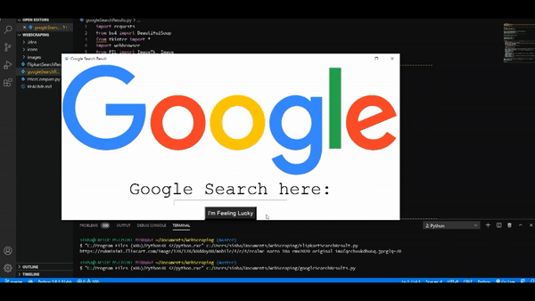
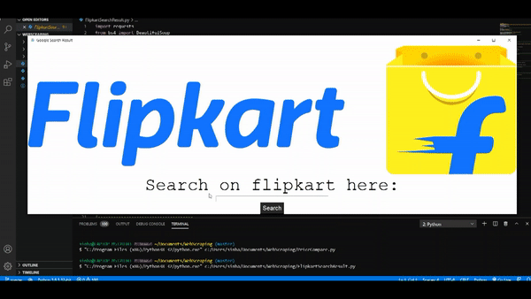
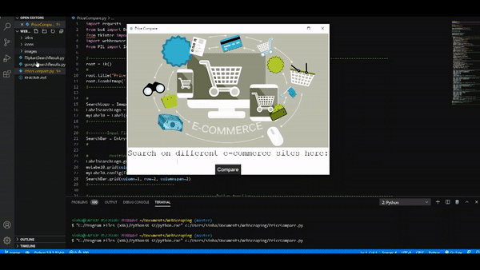

# IEEE LEAD

**NAME :** ANUBHAV SINHA

**GROUP NO.** 8

**MILESTONES ACHIEVED**
* [x] Google search results first url
* [x] Flipkart’s first item with price and image
* [x] Comparing price across e-commerce websites
* [x] Additionals: 
    * Graphical User Interface
    * More details like rating and offers

**TECH STACK**
* Language : python
* Package to scrape data : beautifulsoup
* GUI : tkinter

**DESCRIPTION (About Project)**

My project can be divided into 3 separate milestones:
* **Google search results first url :** The program has a google logo displayed on top, indicating the source of search results. Below that there is a label that says 'Google search here' and beneath that lies the search bar to take user input. Then there is a button that says 'I'm feeling lucky' indicating that it would only give the details of the first result. After displaying the results of the keyword, this button disappears and at the bottom of the results there is a button that directs to the first link of the search results and beneath that is the exit button.

* **Flipkart’s first item with price and image :** This program has a flipkart logo displayed on top, highlighting the e-commerce website scraped. There is label below that saying 'search on flipkart here:'. Then the search bar and the button are similar to the previous program. This program also displays only the first result of the search. Besides name and price it also scrapes rating and current offers. The image scraped is placed next to all these details. And the bottom has a button that directs to the page and then there is an exit button.

* **Comparing price across e-commerce websites :** This program initial interface is same as the other two - a e-commerce banner, an explainatory text, a search bar and a search button. This program scrapes data from 4 different e-commerce wesite - snapdeal, amazon, shopclues and flipkart, and displays details like name, price, rating and offer at a single place for user to compare. Below each result there is a button that directs to the page of the search result. This program scrapes only the first result from each of these websites. At the bottom there is an exit button.

**PROBLEMS FACED**

In the first part I first problem I faced was parsing the html tree of the site. To resolve this I used headers user-agent request header.

In the second part I faced problem with varying selectors on flipkart's website that had random names. I finally found the un-varying selectors on the page with detailed description of the searched product.

In the second part I also faced problem scraping the image url and even more than that displaying the image from a url on tkinter. To resolve this I used urlopen from urllib and BytesIO from io.

After resolving all these problems the third part became an easy task.

**SCOPE OF IMPROVEMENT**

Graphical user interface could be improved in all of the programs. 
In the third part, the results could be sorted on the basis of price or rating. Or we could make that sorting custom as per user's choice.

**WHAT YOU LEARNED?**

I learnt a lot of new things while making this project. Simple websites are easy to scrape but websites that show custom results need a lot of patience for it's inspection and scraping. Though I don't know much about other packages, but I still would say that beautifulsoup was easy to learn. Tkinter is simple yet interesting GUI toolkit. Every time I faced a problem I learnt something new and slowly, this made the project easy for me.